# Jousting Knights

a.k.a. **Amazing Chessboard Patterns**

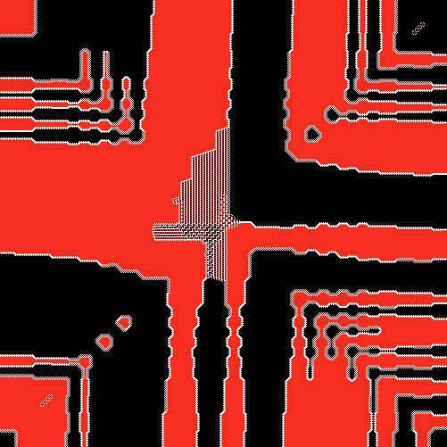</img>

This is an interactive web application for generating chessboard patterns based on the Numberphile videos _[Red & Black Knights (extraordinary result)](https://www.youtube.com/watch?v=UiX4CFIiegM)_ and _[Amazing Chessboard Patterns (extra)](https://www.youtube.com/watch?v=VgmDuBCayPw)_.

The pattern generation rule in a nutshell:

* Fill an oversized chessboard with knights (or generalized [fairy chess pieces](https://en.wikipedia.org/wiki/Fairy_chess_piece)) of one or more opposing armies.
* Start at the center and spiral outwards.
* Skip any square that is threatened by an enemy piece.

This produces incredible patterns, especially when using multiple piece types. See the _Gallery_ below for examples.

In addition to the piece types presented in the videos, this app also features _camels_, _giraffes_, and _stags_.

## Try it out now

Live version: [https://thomas-rosenau.de/jousting-knights](https://thomas-rosenau.de/jousting-knights)

## Usage

* Enter a list of chess pieces in the _Army_ field, separated by spaces or commas.
  Choose a color palette you like and enter it in the _Color palette_ field.
  Note that you need one more color than the number of pieces to account for empty squares.
* Alternatively, pick one of the examples at the bottom or click the _Random_ button!
* Use the provided sliders to control the board size and animation rate.
* The application will draw the resulting pattern.
* You can save the generated image using the save button at the bottom of the page.

## How to install

It's all static files, no build required. Just copy all files in the base folder to a web server.

## Gallery

 Red &amp; Black Knights 
<a href="./gallery/knight-knight-250_000.png">Full image</a> 
<a href="https://thomas-rosenau.de/jousting-knights/#palette=white+red+black&army=knight+knight">Interactive version</a>

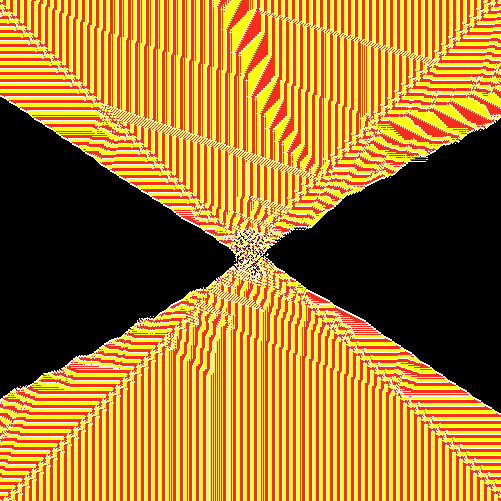 Red Dabbaba, Yellow Wazir, Black Zebra 
<a href="./gallery/dabbaba-wazir-zebra-250_000.png">Full image</a> 
<a href="https://thomas-rosenau.de/jousting-knights/#palette=white+red+gold+black&army=dabbaba+wazir+zebra">Interactive version</a>

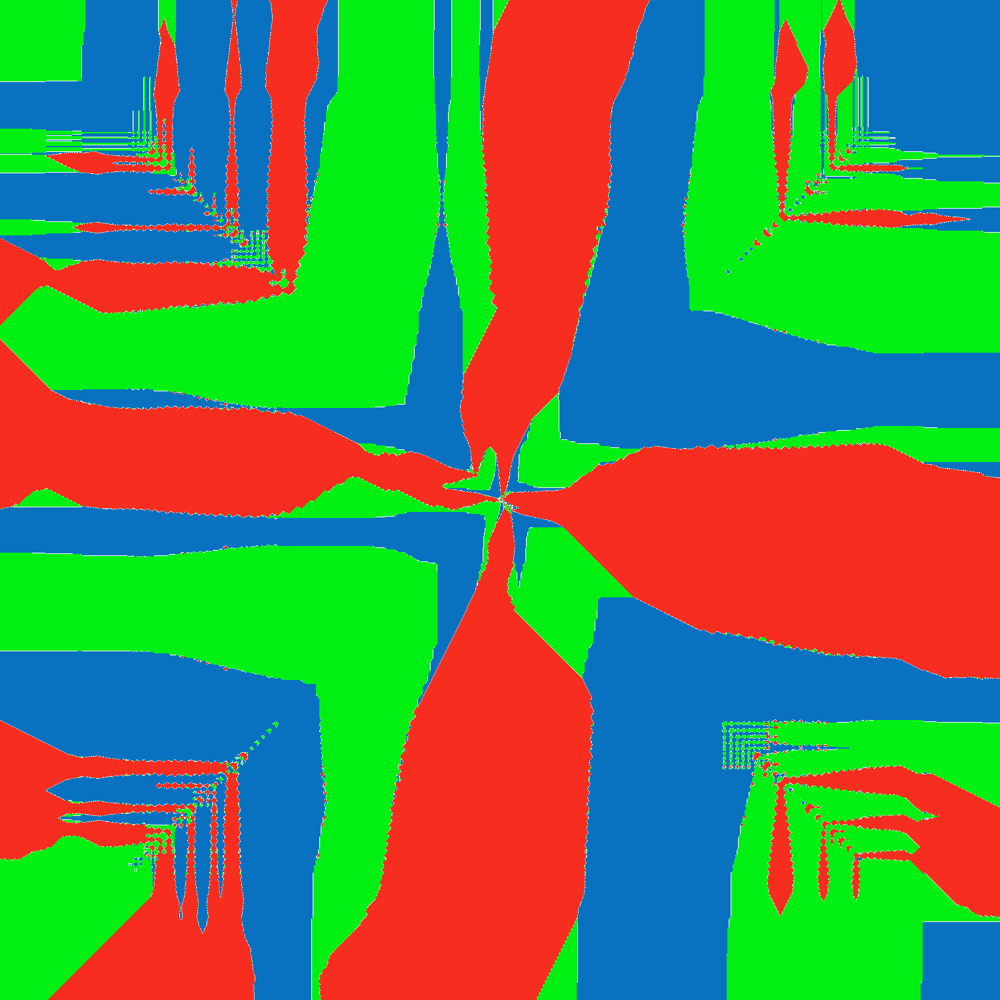 Red Giraffe, Green Dromedary, Blue Camel  
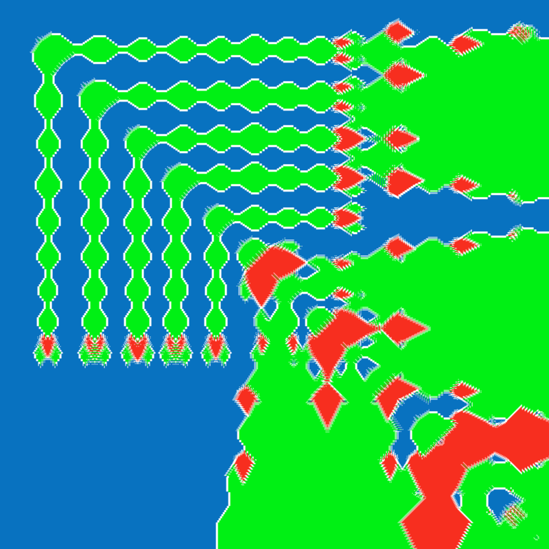 Detail  
<a href="./gallery/giraffe-dromedary-camel-100_000_000.png">Full image</a> 
<a href="https://thomas-rosenau.de/jousting-knights/#palette=white+red+lime+blue&army=giraffe+dromedary+camel&boardSize=6">Interactive version</a>

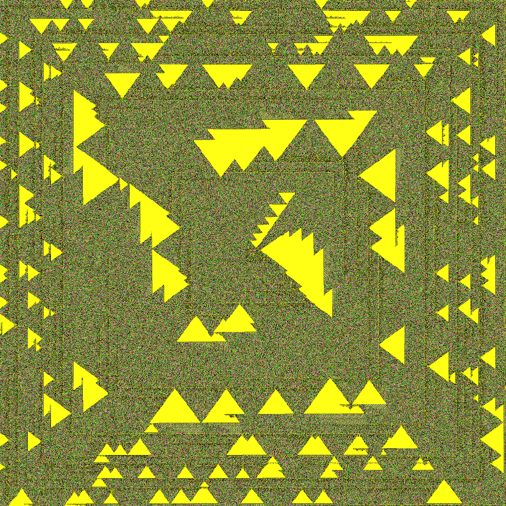 Yellow Antelope, Green Wazir, Pink &amp; Orange Dabbabas 
<a href="./gallery/antelope-wazir-dabbaba-dabbaba-16_000_000.png">Full image</a> 
<a href="https://thomas-rosenau.de/jousting-knights/#palette=white+yellow+green+pink+orange&army=antelope+wazir+dabbaba+dabbaba&boardSize=5">Interactive version</a>

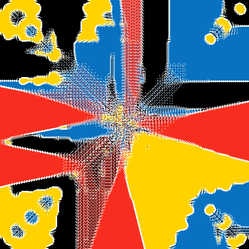 Red Antelope, Black &amp; Blue Zebras, Yellow Camel 
<a href="./gallery/antelope-zebra-zebra-camel-250_000.png">Full image</a> 
<a href="https://thomas-rosenau.de/jousting-knights/#palette=white+red+black+blue+gold&army=antelope+zebra+zebra+camel">Interactive version</a>

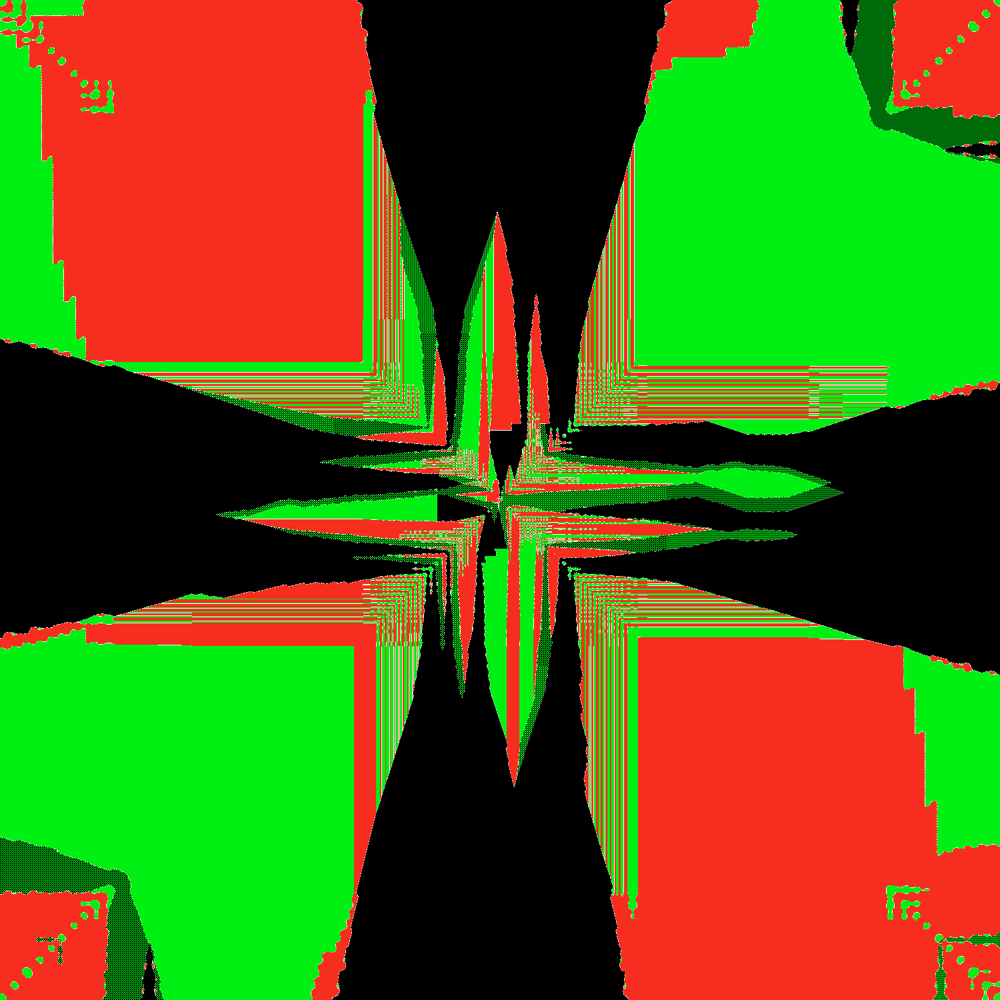 Green Camel, Red Zebra, Black Stag 
<a href="./gallery/camel-zebra-stag-100_000_000.png">Full image</a> 
<a href="https://thomas-rosenau.de/jousting-knights/#palette=white+lime+red+black&army=camel+zebra+stag&boardSize=6">Interactive version</a>

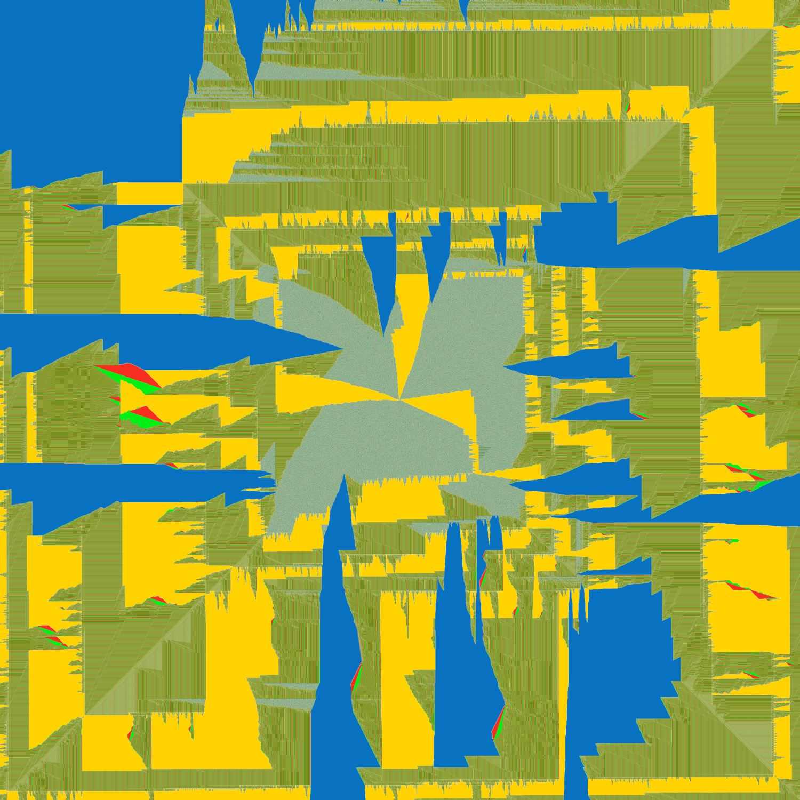 Red Dromedary, Blue Alfil, Yellow Knight, Green Wazir  
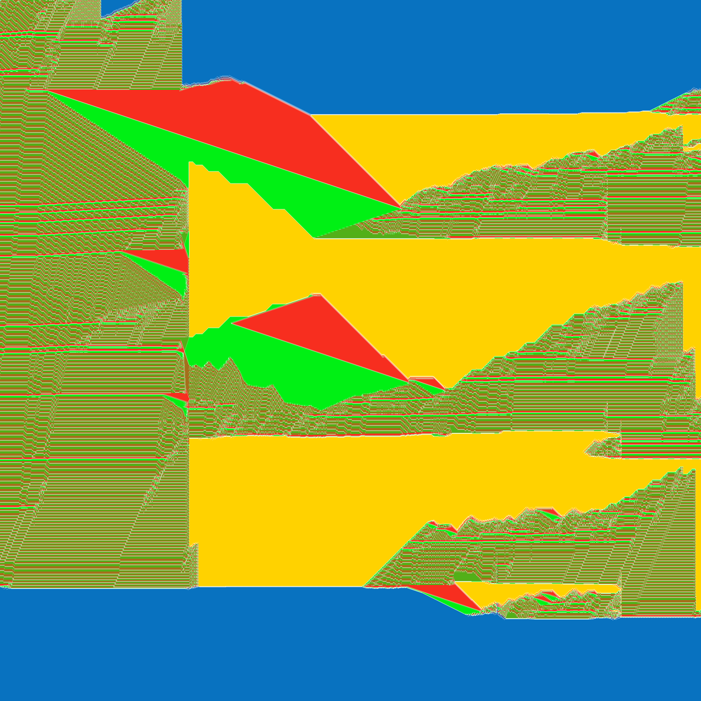 Detail  
<a href="./gallery/dromedary-alfil-knight-wazir-100_000_000.png">Full image</a> 
<a href="https://thomas-rosenau.de/jousting-knights/#palette=white+red+blue+gold+lime+lime&army=dromedary+alfil+knight+wazir&boardSize=5">Interactive version</a>

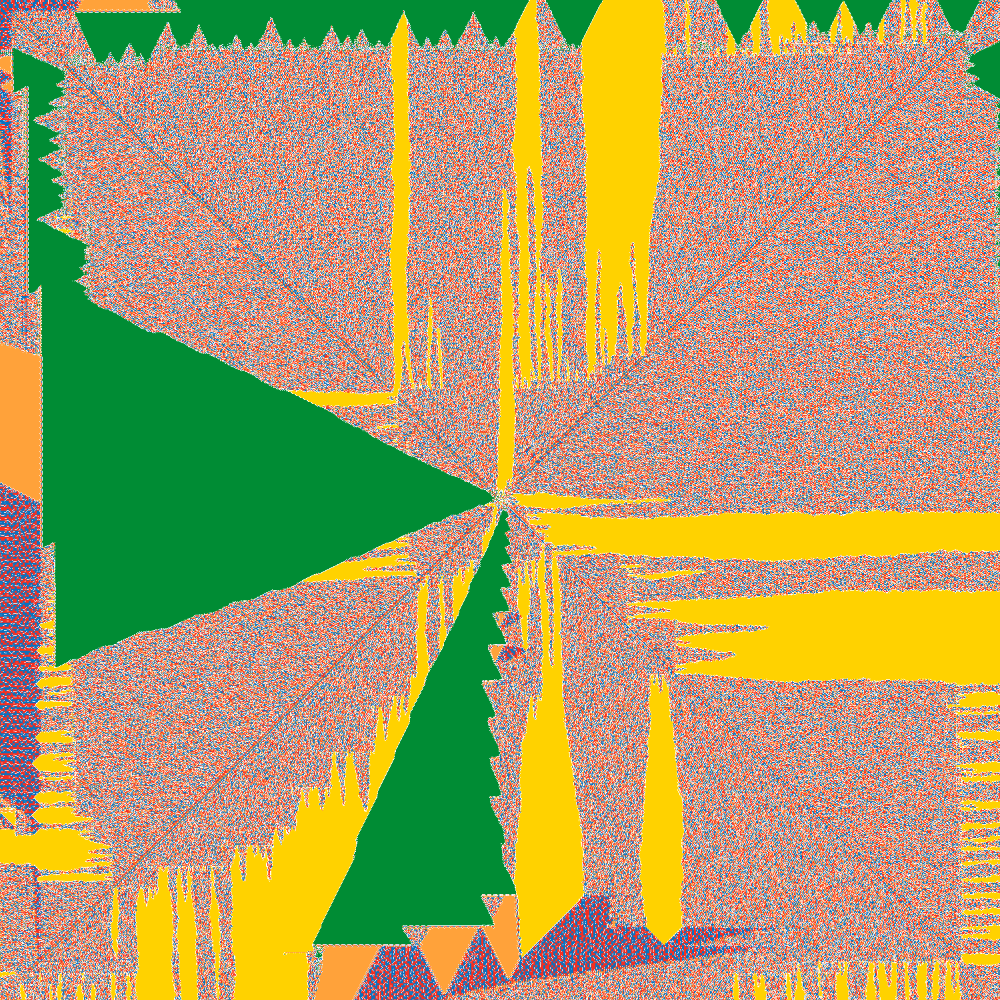 Red &amp; Blue Dromedaries, Yellow Knight, Green Antelope, Orange Alfil 
<a href="./gallery/dromedary-dromedary-knight-antelope-alfil-16_000_000.png">Full image</a> 
<a href="https://thomas-rosenau.de/jousting-knights/#palette=white+red+blue+gold+green+orange&army=dromedary+dromedary+knight+antelope+alfil&boardSize=5">Interactive version</a>

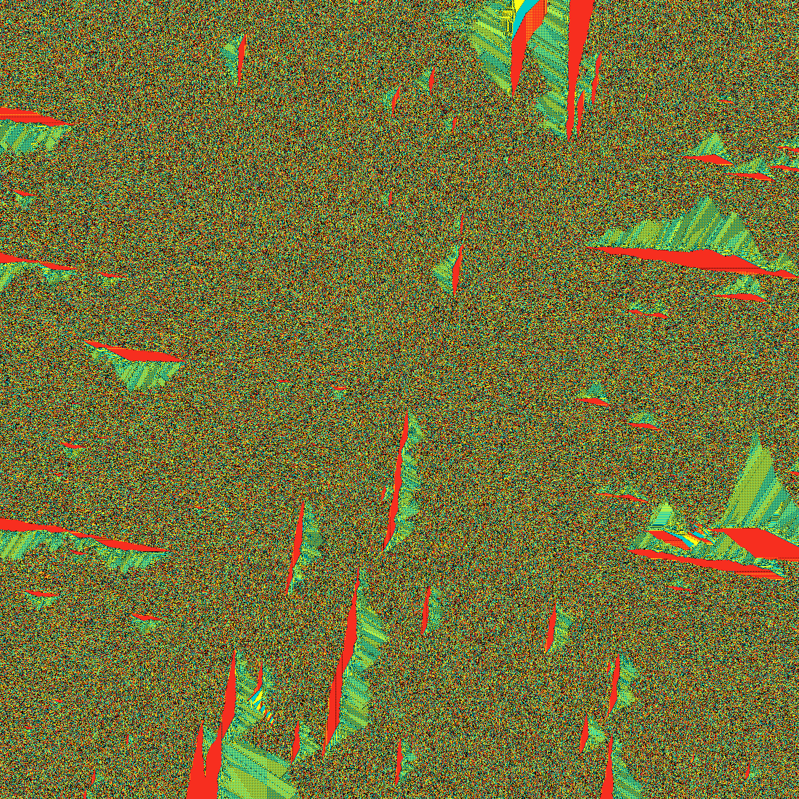 Red Alfil, Cyan Dromedary, Yellow Dabbaba  
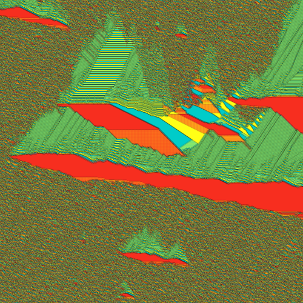 Detail  
<a href="./gallery/alfil-dromedary-dabbaba-100_000_000.png">Full image (⚠️️ 21MB file)</a> 
<a href="https://thomas-rosenau.de/jousting-knights/#palette=black+red+cyan+yellow&army=alfil+dromedary+dabbaba">Interactive version</a>

## License

[Apache 2.0](https://www.apache.org/licenses/LICENSE-2.0)
